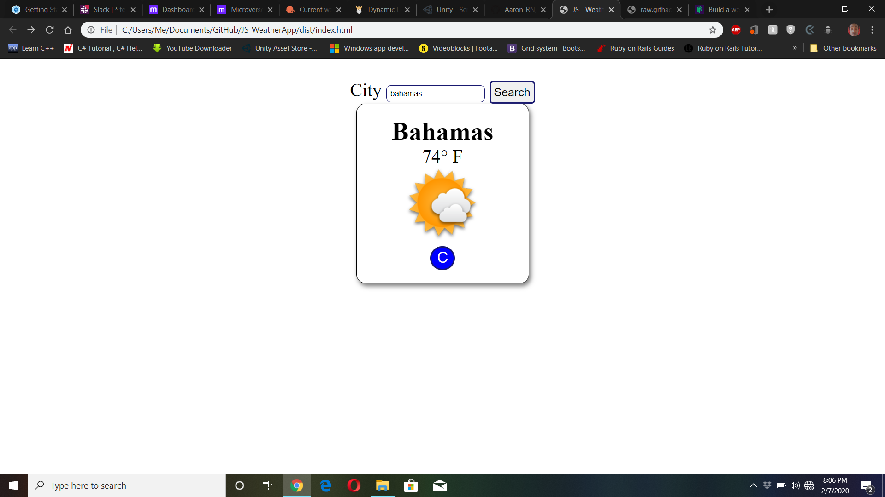

# JS-WeatherApp
Use everything we’ve been discussing to create a weather forecast site using the weather API from the previous lesson. You should be able to search for a specific location and toggle displaying the data in Fahrenheit or Celsius.

## Live Link
Live Githack Link: https://raw.githack.com/Aaron-RN/JS-WeatherApp/development/dist/index.html

## Built With

- HTML, CSS
- JavaScript
- Node.js
- NPM Webpack

## Authors

👤 **Aaron Rory**

- Github: [@Aaron-RN](https://github.com/Aaron-RN)
- Twitter: [@ARNewbold](https://twitter.com/ARNewbold)
- Linkedin: [Aaron Newbold](https://www.linkedin.com/in/aaron-newbold-1b9233187/)

## 🤝 Contributing

Contributions, issues and feature requests are welcome!

Feel free to check the [issues page](issues/).

## Show your support

Give a ⭐️ if you like this project!

## 📝 License

This project is [MIT](lic.url) licensed.
